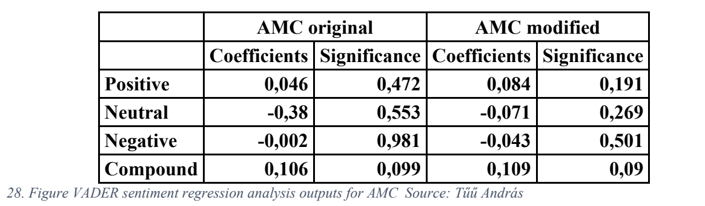

# Bachelor’s Thesis Project: Analysis of "Meme Stocks" and Social Media Influence

## Abstract
This thesis explores the internet and stock market phenomenon surrounding "meme stocks," specifically GameStop (GME) and AMC, which saw extreme price volatility in early 2021. It investigates the drivers behind these price surges, analyzing whether these movements were influenced by fundamental value, a short squeeze, or sentiment from the Reddit community, WallStreetBets.

Using sentiment analysis with VADER and Text2Emotion on 170,000 Reddit posts, the research finds a weak but significant positive relationship between sentiment and share price for both stocks, particularly for GME, which experienced a validated short squeeze. For AMC, sentiment-driven activity appears more likely responsible for price increases.

## Methodology
- **Sentiment Analysis:** Applied VADER and Text2Emotion packages to Reddit posts mentioning GME and AMC.
- **Financial Data:** Created Dicounted Cash FLow model, analyzed daily price, short interest, volume, and post mentions for each stock.
- **Comparative Analysis:** Benchmarked GME’s 2021 price movement against prior short squeezes, such as Volkswagen in 2008.

## Key Findings
- **GameStop (GME):** Evidence of a short squeeze was found, with sentiment positively impacting the average daily share price.
- **AMC:** A sentiment-driven price increase is likely responsible for AMC’s rise, without strong evidence of a short squeeze.

This analysis highlights the potential influence of online retail sentiment on market prices and provides insights into the dynamics of sentiment-driven trading in modern financial markets.

## Regression Analysis Results

### AMC Sentiment Analysis (VADER)

*Figure: VADER sentiment regression analysis outputs for AMC*

### AMC Sentiment Analysis (Text2Emotion)

*Figure: Text2Emotion sentiment regression analysis outputs for AMC*

### GME Sentiment Analysis (VADER)

*Figure: VADER sentiment regression analysis outputs for GME*

### GME Sentiment Analysis (Text2Emotion)

*Figure: Text2Emotion sentiment regression analysis outputs for GME*

---

This repository contains all code, data, and analysis related to this project. For more detailed explanations and insights, please refer to the full thesis document.
